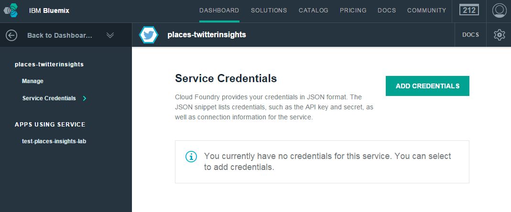
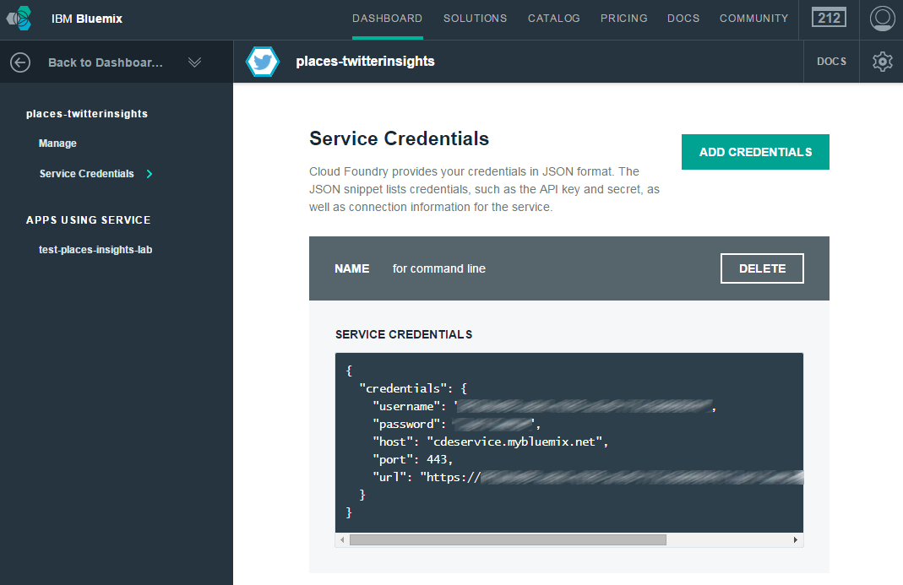
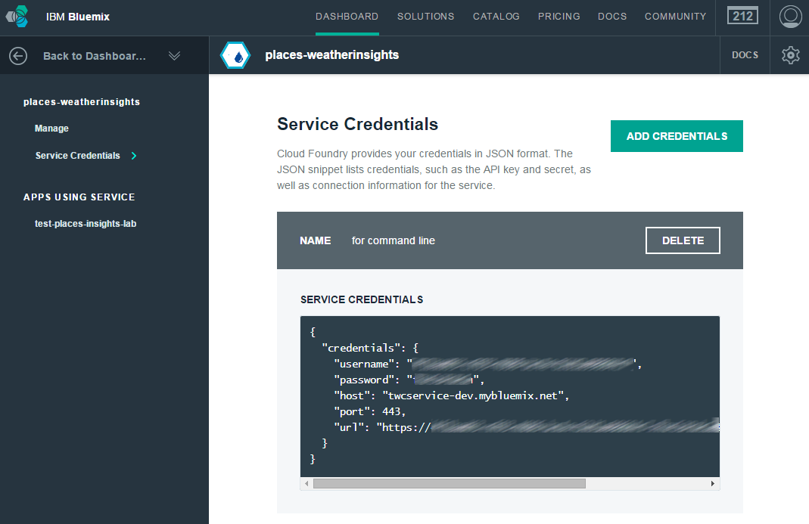

# Places Insights Hands on Labs - Command Line Instructions

These instructions guide you through the steps of deploying,
modifying and running the lab from the command line.

## Pre-requisites

  * a working Node.JS environment (v0.12+)
  * npm
  * git
  * cf
  * your favorite text editor

## Creating a IBM Bluemix account

1. Sign up for IBM Bluemix at [the registration page][bluemix-signup-url] if you don't already have a IBM Bluemix account.

2. Log in your IBM Bluemix account.

## Get the code

1. Clone the app to your local environment from your terminal using the following command

```
git clone https://github.com/IBM-Bluemix/places-insights-lab.git
```

2. cd into this newly created directory

3. Edit the `manifest.yml` file and change the `<application-name>` (places-insights-lab)
and `<application-host>` (places-insights-lab) to something unique.

```
applications:
- services:
  - places-twitterinsights
  - places-weatherinsights
  name:       places-insights-lab
  host:       places-insights-lab
  path:       .
```

The host you use will determinate your application url initially, e.g. `<application-host>.mybluemix.net`.

4. Connect to IBM Bluemix using the command line tool and follow the prompts to log in.

```
$ cf api https://api.ng.bluemix.net
$ cf login
```

5. Create the Insights for Twitter service in Bluemix.

```
$ cf create-service twitterinsights Free places-twitterinsights
```

6. Create the Insights for Weather service in Bluemix.

```
$ cf create-service weatherinsights-dev Free places-weatherinsights
```

7. Push the application to Bluemix.

```
$ cf push
```

You now have your very own instance of Places Insights lab running on IBM Bluemix.
Navigate to the application url, e.g. `<application-host>.mybluemix.net`.

## Running locally

You can run the application locally, connecting to the services running in IBM Bluemix.
To do so you need we will create one file to store the Insights for Twitter and Insights for Weather service credentials.
These credentials can be retrieved in the IBM Bluemix dashboard.

### Get credentials for the services

1. Open the IBM Bluemix dashboard.

2. Locate the previously created Insights for Twitter service named *places-twitterinsights*.

3. Select the service.

4. Select the "Service Credentials" option

  

5. Click "Add Credentials" and give them a name (e.g. *for command line*).

  A new set of credentials is created for this service.

  

6. Repeat the previous steps with the Insights for Weather service named *places-weatherinsights*.

  

### Write credentials to vcap-local.json

Create a file named ```vcap-local.json``` in the app directory with the following content, replacing the urls with the ones found in the credentials
you just created for the two services:

```
{
  "services": {
    "twitterinsights": [
      {
        "name": "places-twitterinsights",
        "label": "twitterinsights",
        "credentials": {
          "url": "<TWITTER-INSIGHTS-CREDENTIALS-URL>"
        }
      }
    ],
    "weatherinsights": [
      {
        "name": "places-weatherinsights",
        "label": "weatherinsights",
        "credentials": {
          "url": "<WEATHER-INSIGHTS-CREDENTIALS-URL>"
        }
     }
   ]
  }
}
```

### Retrieve project dependencies

In the project directory, run:

```
$ npm install
```

This will get all the server-side and client-side (through *bower*) dependencies for the project.

### Start the application

Then start the application:

```
$ node app
```

The console output will look like:

```
Loaded local VCAP { services: { twitterinsights: [ [Object] ], weatherinsights: [ [Object] ] } }
server starting on: http://localhost:6009
server started  on: http://localhost:6009
```

Navigate to the given link to access the application.

## Modify the app

Now that you have the basics running it is time to add more functionality to this application,
mainly retrieving weather and tweets for the selected location.

1. Let's edit our source code. In your favorite editor, open `public/js/app.js`

2. Locate the comment *Retrieve current weather*. The implementation of the function currently returns an empty object. Comment the line returning the empty object and uncomment the actual code calling the server API. Note that the implementation calls an API on the backend, passing the latitude and longitude of a location.

3. Repeat the same operation for the comment *Retrieve 10 day forecast*. The code to uncomment will call the backend API to get weather forecast.

4. Repeat the same operation for the comment *Retrieve tweets for location*. The code to uncomment will call the backend API to get some tweets about the location.
  
5. Save the file

## View your changes

If you are running locally, simply refresh your web-browser.

To push your changes to IBM Bluemix run:

```
$ cf push
```

## Privacy Notice
The lab application includes code to track deployments to IBM Bluemix and other Cloud Foundry platforms. The following information is sent to a [Deployment Tracker](https://github.com/IBM-Bluemix/cf-deployment-tracker-service) service on each deployment:

* Application Name (application_name)
* Space ID (space_id)
* Application Version (application_version)
* Application URIs (application_uris)

This data is collected from the VCAP_APPLICATION environment variable in IBM Bluemix and other Cloud Foundry platforms. This data is used by IBM to track metrics around deployments of sample applications to IBM Bluemix. Only deployments of sample applications that include code to ping the Deployment Tracker service will be tracked.

### Disabling Deployment Tracking

Deployment tracking can be disabled by removing `require("cf-deployment-tracker-client").track();` from the beginning of the `app.js` file.

[bluemix-signup-url]: https://console.ng.bluemix.net/registration/
[insights-twitter-url]: https://console.ng.bluemix.net/catalog/ibm-insights-for-twitter/
[insights-weather-url]: https://console.ng.bluemix.net/catalog/ibm-insights-for-weather/
[bluemix-console-url]: https://console.ng.bluemix.net/
